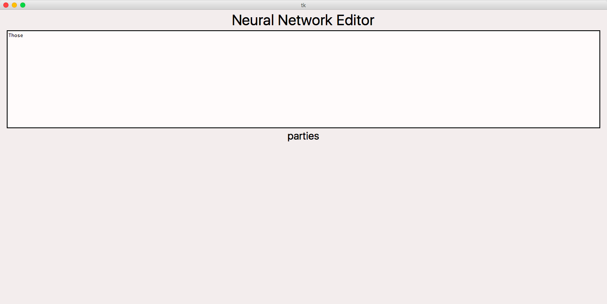
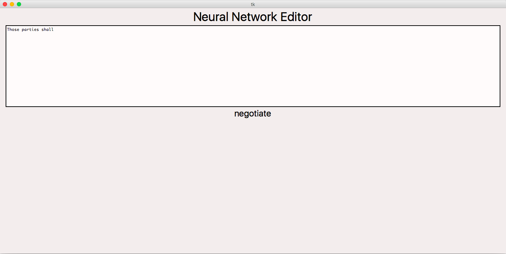

# Deep-Learning-Neural-Network-Editor
Applied Recurrent Neural Network to build a text editor that can capture words that user types in, analyze the entire sequence of them and finally give prediction for the next word.

# Run the application
In order to run the application, please click on the file "test.jpynb"

# Visualization

